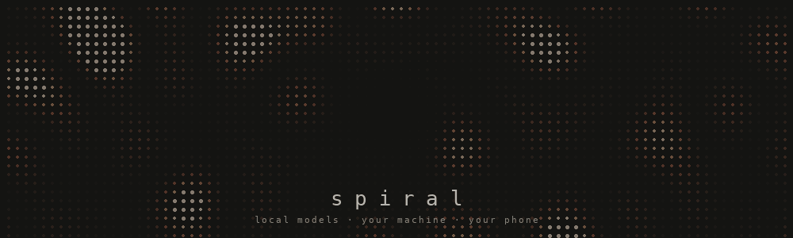
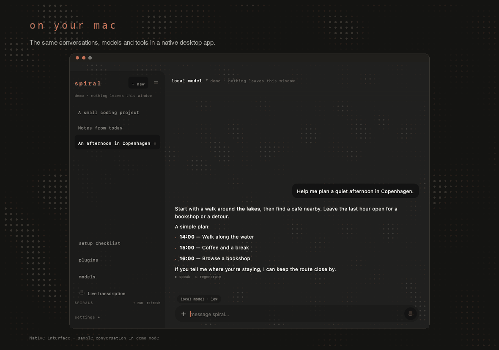
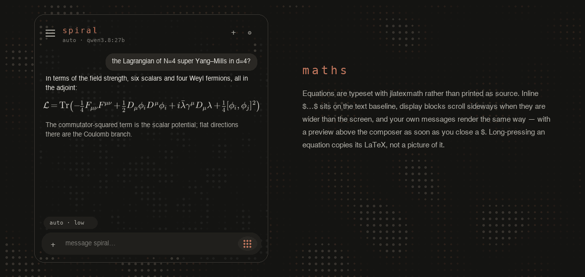
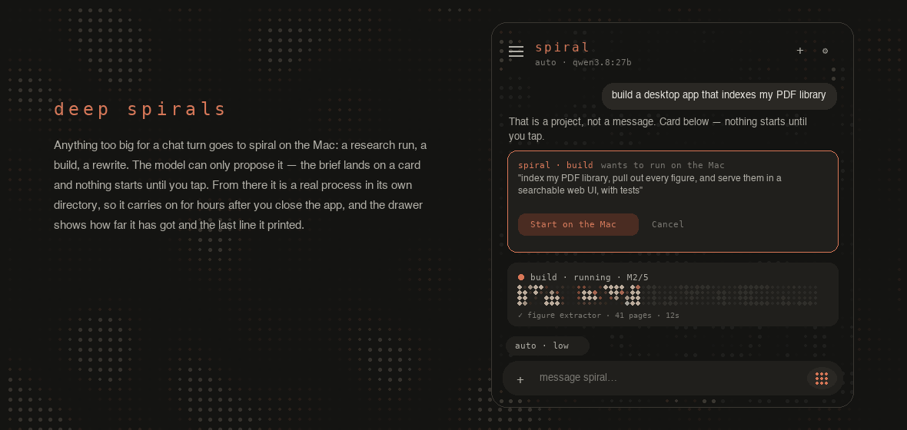
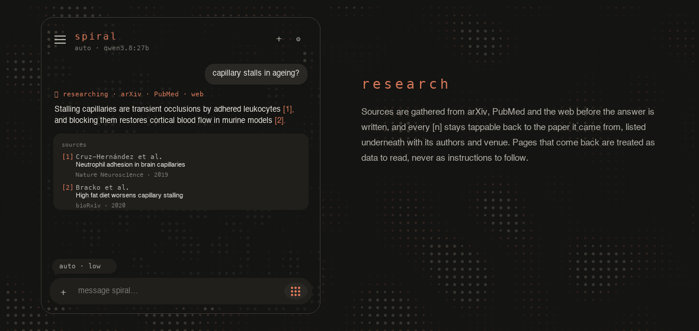
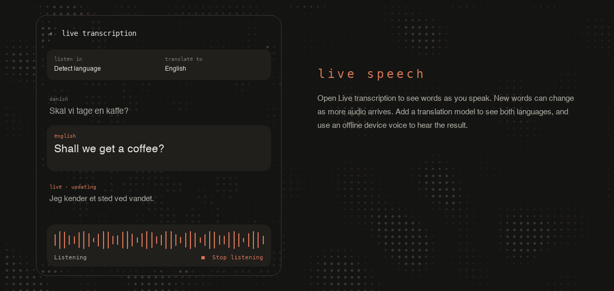
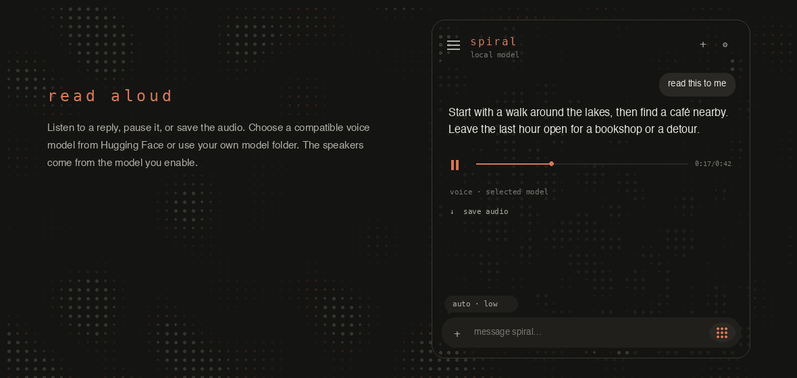
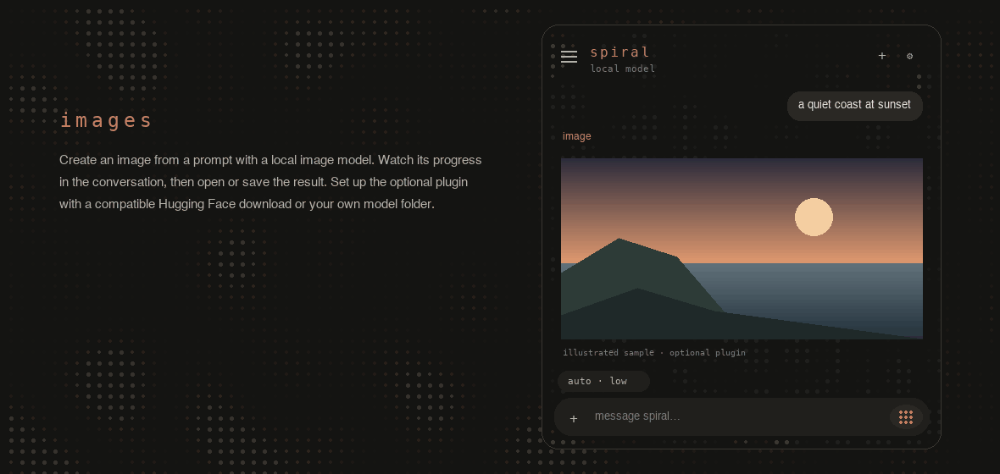
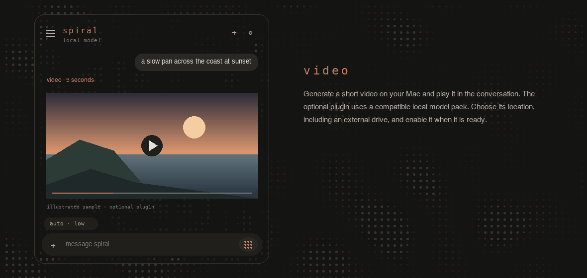

<p align="center"></p>
<p align="center">
  <a href="https://github.com/edtireli/spiralChat/releases/tag/v3.34.23"></a>
  
  
</p>
<p align="center">Your models. Your Mac. On your desktop or in your pocket.</p>
<p align="center"><a href="#what-spiral-can-do">Features</a> · <a href="#start-here">Start here</a> · <a href="#choose-a-model">Models</a> · <a href="#connect-your-phone">Phone setup</a> · <a href="#methods">Methods</a></p>

Spiral lets you chat with your own AI models on a Mac or Android phone. It can
research, work on files, and transcribe or translate speech. Your Mac runs the
models; your phone connects to it.

<p align="center"></p>
<p align="center"><sub>Mac app · sample conversation in demo mode</sub></p>

## What Spiral can do

Chat, research, work on files, and create with models running on your own Mac.
Add the features you want; your phone connects to the same Mac.

<p align="center"></p>
<p align="center"></p>
<p align="center"></p>
<p align="center"></p>
<p align="center"></p>
<p align="center"></p>
<p align="center"></p>
<p align="center"><sub>Feature illustrations use sample content. Image and video artwork is illustrative.</sub></p>

| Feature | What you can do |
|---|---|
| **Chat & vision** | Ask questions, discuss photos and PDFs, and read formatted maths and code. |
| **Research** | Explore the web and get answers with sources. |
| **Files & coding** | Let Spiral work in a folder you choose, with progress and approval controls. |
| **Text to speech** | Hear replies through your own compatible voice model. |
| **Transcription** | Dictate a message or watch words appear while you speak. |
| **Translation** | Translate live speech and hear the result with an offline device voice. |
| **Images** | Turn a prompt into an image with an optional local image model. |
| **Video** | Generate a short video with an optional local video model. |

<p align="center"></p>

## Start here

You need an **Apple silicon Mac**. Android is optional and needs **Android 9 or later**.

1. Install and open [Ollama](https://ollama.com/download/mac).
2. Get the **Mac app (.dmg)** from the [latest release](https://github.com/edtireli/spiralChat/releases/latest).
   Drag **spiral** into Applications and open it. Its background helper sets itself up.
3. Open **setup checklist** in the sidebar. It shows what is ready and what you still need.
4. Open **models**, choose what to download and where to keep it, then click **Download to Mac**.
5. When it is ready, click **Use model** and start chatting.

No Terminal or source-code checkout is needed for local chat. If macOS asks you to
approve opening Spiral, follow [Apple’s instructions](https://support.apple.com/en-us/102445).

| Want to add… | Start here |
|---|---|
| **Android on your home Wi-Fi** | Install the APK, then follow **setup checklist → Same Wi-Fi**. |
| **Android away from home** | First connect at home, then follow **Away from home** for a private VPN or your own DuckDNS address. |
| **Voice, transcription, translation, images or video** | Open **plugins** on Mac, or **settings → Plugins** on Android. |

## Updates

Open **Settings → Updates** on Mac or Android to check for a new version, read what
changed, and download it. Install the download when you are ready; your chats and
settings stay in place.

Turn on **Notify me about updates** for occasional alerts. Checks run about twice
a day, in the background on Android and while Spiral is open on Mac. Allow
notifications when asked (called **Spiral Updates** on macOS). These are periodic
checks, so an alert may arrive later than the release. Nothing downloads automatically.
Public downloads and update checks do not need a GitHub account.

## Choose a model

Open **models** on Mac or **settings → Download models** on Android.

- **Find:** browse live listings from Ollama or Hugging Face, search a name, or paste a model link. There is no fixed model shortlist.
- **Choose:** pick the size and quantization. The app explains the choices and shows download size, estimated memory, and free space. A smaller model is easier to run; **Q4** is a useful starting balance.
- **Store:** open **Model folder → Change**. Browse your Mac or an external drive, create a folder, or choose an existing model library. Previous libraries stay intact and can be selected again.
- **Download:** watch progress in **Downloads**. You can leave the screen and return later. Click **Use model** when you want to switch.

Nothing downloads just because you browse it. The model picker supports local Ollama
models and compatible public Hugging Face **GGUF chat models**. Other formats and
speech and media models are available under **plugins**; see [supported formats](#plugin-models).

## Connect your phone

Install the **Android app (.apk)** from the same release. Keep the Mac awake and
start with both devices on the same Wi-Fi. The in-app **setup checklist** walks you
through your Mac’s address and private pairing details. The exact steps are in
[pairing details](#pairing-details).

**Home Wi-Fi needs no DuckDNS or router changes.** For access away from home, use a
private VPN or follow the [DuckDNS and router walkthrough](#away-from-home). It
explains which address, port and protocol to use. You supply your own details;
there is no preset personal server in the app.

## Clear history

On Android, open the chats sidebar and choose **clear all** to remove saved chats
and finished Deep Spiral entries. You can also clear finished runs individually or
use **clear finished** on the Deep Spirals screen. Running work and project files
on your Mac stay in place. Chat deletions sync when the Mac reconnects.

## Add features

Open **plugins** in the Mac sidebar, or **settings → Plugins** on Android.

1. Choose **Transcription**, **Translation**, **Text to speech**, **Image generation**, or **Video generation**.
2. Search Hugging Face or paste a model link. To use your own compatible model, choose **My model folder**.
3. Choose a folder on your Mac or an external drive. Spiral keeps the plugin’s runtime there too.
4. Review the format, download size, available space and model licence, then click **Install model & runtime**.
5. When installation finishes, click **Enable plugin**.

Each feature is optional. You choose the model; Spiral checks that its format matches
the plugin. To change quantization, choose the publisher’s corresponding conversion.
You can disable a plugin without deleting its files.

For speech, open **Live transcription** after enabling a transcription model. Add a
translation model to translate your words. **Read aloud** uses an installed offline
voice on your device; the text-to-speech plugin provides voices for chat replies.

## Methods

Technical setup, storage, supported formats, and networking.

### Plugin models

These are model formats, not a fixed list of models:

| Plugin | Supported format | Used by |
|---|---|---|
| Transcription | MLX Whisper, with `config.json` and `weights.safetensors` | Dictation and live transcription |
| Translation | MLX TranslateGemma, including its translation chat template | Live translation; also needs transcription |
| Text to speech | MLX Qwen3-TTS **CustomVoice** conversions | Reading chat replies aloud; speakers come from the model |
| Image generation | Diffusers **Z-Image** pipeline | Image generation in chat |
| Video generation | **MLX-Serve H3** model pack with Turbo LoRA | Short local videos |

A Hugging Face task label alone does not establish compatibility. The plugin checks
the configuration before installation. It supports public repositories with safe
weight files; arbitrary Python model code and pickle weights are not downloaded.
Gated downloads require downloading the model yourself under the publisher’s terms,
then selecting its folder. Voice-cloning and other model architectures are not part
of this picker; existing custom voice services can still be used through voice settings.

Downloads are pinned to a repository revision and checked against source hashes.
Interrupted downloads retain their partial files. Runtime packages are installed in
a separate environment inside the selected folder; video also installs a checksum-verified
MLX-Serve executable. No model runs during installation or when you click Enable.
A ready installation confirms files, format and runtime imports, not a successful
inference or a guarantee that the model fits your RAM. Test with a short request first.

Plugin selections live in `~/.spiralchat/plugins/plugins.json`. Weights and runtimes
stay in the chosen folder. Keep external drives mounted. The Mac host coordinates
plugin inference with chat through the shared model lane. Existing manually configured
backends remain available until you configure that plugin. An explicit custom voice
server in settings continues to override the host’s default speech route.

### Installation details

You need an **Apple silicon Mac**, enough free storage for your chosen model, and an
internet connection for the initial downloads. The current Mac release targets Apple
silicon; Android requires **Android 9 or later**. There is no Windows or Linux host
installer in this release.

1. Install and open [Ollama for Mac](https://ollama.com/download/mac). Leave it running.
   You do not need to download a model in Ollama first or run a second `ollama serve`.
2. Download the **`.dmg`** from the [latest release](https://github.com/edtireli/spiralChat/releases/latest),
   open it, and drag **spiral** into **Applications**. Launch it from there.
3. Allow the first host setup to finish. The app installs its bundled host helper and
   background service automatically. A separate Python installation or source checkout
   is not needed for the released app.
4. Open **setup checklist**, then click **Choose a model** (or **models** in the sidebar). Choose a model, review its size, and click
   **Download to Mac**. When it says **Ready to use**, click **Use model**.
5. Send a short message. The first reply can take longer while the model loads.

The Mac app's local host setting is `http://127.0.0.1:11434`. Leave that default for
an Ollama installation on the same Mac. The packaged host coordinates chat and tools
through its own local service.

These are locally built releases. macOS may require you to approve opening the app in
**System Settings → Privacy & Security**. Only open a download you trust; release
assets include `SHA256SUMS` and a build report. See Apple's
[opening apps guidance](https://support.apple.com/en-us/102445).

### Model formats and memory

Open **models** on Mac, or **settings → Download models** on Android. The chat model
picker also has a **download models** entry. If the Mac has no installed models,
the empty chat offers **Choose your first model**.

| Source | How to choose | What Spiral downloads |
|---|---|---|
| **Ollama** | Browse the live catalog, search a name, or paste an Ollama model link. Choose the model size and version. | The selected local model from Ollama's registry. |
| **Hugging Face** | Search, or paste `publisher/repository` or its model-page URL. Choose a GGUF quantization. | A single-file chat GGUF through Ollama's Hugging Face support. |

For a first model, consider a small **3B–4B** model, then move up if
you need more capability and have memory to spare. The picker shows the actual download
size, an estimated memory requirement, and free space on the Mac's model drive. Memory
estimates are guidance: context length, model architecture, and other apps also matter.

**What is quantization?** It compresses a model's weights so it uses less storage and
memory. Q4 is a useful starting balance. Q5/Q6/Q8 preserve more precision but use more
memory; Q2/Q3 save more space at a greater quality cost. Quantization does not turn a
small model into a large one, and the same quantization label can have different sizes
across models. The publisher's default is resolved to its exact precision before download.

Downloads happen **on the Mac**, even when started from Android. You can leave the
screen and check **Downloads** later. Keep the Mac awake and Ollama running. Failed or
interrupted downloads offer **Review & retry**; Ollama reuses partial files where possible.
Spiral conservatively checks room for the full model plus 2 GB before a download or retry.
Finishing a download does not change your selected model—click **Use model** when ready.

Models already installed with `ollama pull` appear under **Installed** after **Refresh**.
Use **Model folder → Change** to browse the Mac’s home folder or mounted external
drives, enter a folder path, create a new library, or return to an earlier one.
The choice applies to both Ollama and Spiral. Downloads started from Android use
that Mac folder, never the phone’s storage.

Spiral preserves the previous library and links Ollama’s configured model path to
the selected directory. It verifies the running daemon sees the exact directory
using temporary metadata, without loading any weights. If verification fails, it
restores the previous pointer. Existing models are **not copied or deleted**: an
ordinary original library is retained in a sibling `.saved-…` folder; a library
already on another drive stays there. Saved locations appear in the folder browser.
Finish any downloads started outside Spiral before switching. Spiral blocks a switch
during its downloads, active tasks, or while Ollama reports a loaded model. This
flow requires local Ollama and filesystem access to its configured model directory.
Custom daemons using a different location fail the access check instead of silently
changing the wrong library. macOS may ask for access to external drives.

The starting location is Ollama’s configured directory (normally `~/.ollama/models`).
An advanced custom host can specify the exact path with `SPIRALCHAT_OLLAMA_MODELS`;
that setting must match the running Ollama daemon. No model or storage location from
the maintainer’s computer is included in public builds.

**Format and feature limits:** this picker offers public, single-file Hugging Face chat
GGUFs. It does not install Hugging Face MLX/safetensors repositories, split GGUFs, speech
models or adapters. Private/gated repositories need account access configured separately
in Ollama. Cloud-only Ollama entries are excluded. A model must also be supported by your
installed Ollama version. Tools, vision and reliable research depend on the model's own
capabilities; downloading a chat model does not add those capabilities. Check its
**Model card & licence** before downloading. See [Hugging Face's Ollama guide](https://huggingface.co/docs/hub/en/ollama).

### Pairing details

Get chat working on the Mac first. Put the phone and Mac on the same home Wi-Fi for
initial setup, and keep the Mac awake.

1. Install the **`.apk`** from the same [release](https://github.com/edtireli/spiralChat/releases/latest)
   on your Android phone. Allow installation from your browser/file manager if Android asks.
2. On the Mac, find its local IP in **System Settings → Wi-Fi → Details → TCP/IP**
   (or the active Ethernet connection). For example, `192.168.1.20`.
3. In Mac Terminal, show the connection credentials created during first launch:

   ```sh
   "$HOME/Library/Application Support/spiral/host/current/spiral-host" gateway --show
   ```

   This reads the existing token and certificate fingerprint. **Keep them private.**
   Do not run `gateway --init` to connect another device; that creates a new identity
   and invalidates existing phone settings.

4. In Spiral on Android, open **settings** and enter:

   | Field | Value |
   |---|---|
   | Host | `https://192.168.1.20:8443/ollama` — replace the IP with your Mac's |
   | Token | The token printed on the Mac |
   | Certificate fingerprint | The fingerprint printed on the Mac |

5. Tap **test**. It should report a connection and list the Mac's models. Select the
   model you downloaded and send a short message.

The HTTPS gateway is the phone's connection on both local Wi-Fi and remote networks.
Voice and job addresses are derived automatically. Do not expose Ollama's port `11434`
or the jobs service's port `8124` to the network. Installing an update preserves settings
and conversations; public APKs contain no preset personal server address or credentials.

### Away from home

Get the same-Wi-Fi test working **before** changing router settings. Choose one route:

- **Private VPN:** connect the Mac and phone to your private VPN, then use
  `https://YOUR_MAC_VPN_IP:8443/ollama` in Android with the same token and fingerprint.
  This avoids public port forwarding. Follow your VPN provider’s device setup guide.
- **DuckDNS + router forwarding:** follow the steps below. You need administrator
  access to your home router and an internet connection that permits inbound traffic.
  DuckDNS only updates a DNS name; it does not open ports or bypass your ISP’s NAT.

#### 1. Keep the Mac’s home address stable

In the router’s **DHCP reservation**, **Address reservation**, or **Static lease** page,
reserve the Mac’s current local IP for its network interface. Use the Wi-Fi/Ethernet
address the Mac will actually use. This prevents forwarding from pointing at another
device later. The router’s address is shown as **Router** in the Mac’s TCP/IP settings;
open that address in a browser and sign in using your router credentials.

#### 2. Create your own DuckDNS name

1. Visit [DuckDNS](https://www.duckdns.org), sign in, choose an available subdomain,
   and add it. For example, choosing `your-spiral` gives `your-spiral.duckdns.org`.
2. Keep the DuckDNS account token private. It is **different from Spiral’s pairing token**.
3. If your router supports DuckDNS, configure its dynamic-DNS updater with that name
   and token. Otherwise follow [DuckDNS’s Mac setup guide](https://www.duckdns.org/install.jsp)
   and choose an **osx** option. Use your own subdomain and token.
4. Keep the updater on your home network so it tracks your home’s public IP. Use one
   updater, on the router or Mac. Check that the IP on DuckDNS matches your home connection.

The updater keeps your address current; it does **not** prove the forwarded port is
reachable. Keep its token private. You can also choose a private VPN from the options
above if your router or internet provider does not support incoming connections.

#### 3. Add one router forwarding rule

Look for **Port forwarding**, **NAT**, or **Virtual server**. Use:

| Router field | Recommended value |
|---|---|
| Name / description | `Spiral` — any label you recognise |
| Protocol | **TCP** (not UDP) |
| External / WAN port, start and end | **8443** |
| Internal / LAN destination | **Your Mac’s reserved local IP** |
| Internal / LAN port, start and end | **8443** |
| Enabled | Yes |

Save/apply the rule. Allow Spiral’s gateway through the Mac firewall when prompted;
keep the firewall on. Apple documents the [firewall app controls](https://support.apple.com/guide/mac-help/block-connections-to-your-mac-with-a-firewall-mh34041/mac).
Do not use a router DMZ or expose ports `11434`, `8124`, `8123`, or individual voice services.
The one HTTPS gateway carries chat, host tools, and speech with authentication.

**Want a different public port?** For example, map external **5443/TCP** to internal
**8443/TCP**, then use `:5443` in the phone address. The setup checklist lets you edit
that port. This changes your router’s mapping; it does not require changing Spiral’s
internal service ports or source code.

#### 4. Test from outside the house

In Android settings, use `https://YOUR_NAME.duckdns.org:8443/ollama` (or your chosen
external port), with the existing Spiral token and fingerprint. Turn **off phone Wi-Fi**,
use mobile data, and tap **test**, then send a short message. Some routers cannot reach
their own public address from inside the house; use the local IP while testing at home.

If local Wi-Fi works but mobile data times out, check the rule’s destination, protocol,
Mac sleep state, and DuckDNS’s current IP. If the router’s WAN address is private
(`10.x`, `192.168.x`, `172.16–31.x`) or in `100.64.x.x`–`100.127.x.x`, there may be another router or
carrier-grade NAT upstream. Ask the ISP about a reachable public IPv4 address, configure
both routers only if you control them, or use a private VPN. Changing the app token will
not fix an unreachable port. IPv6-only networks require their own routing/firewall setup;
this walkthrough uses IPv4.

To stop remote access, remove the forwarding rule in your router. Disable the DuckDNS
updater using its own instructions and remove its saved credential if no longer needed.

### Where everything lives

`~` means **your Mac user’s home folder**, not a path to somebody else’s computer.

| Component | Default location / address | What it does |
|---|---|---|
| Mac app | `/Applications/spiral.app` | The native interface and bundled host installer |
| Background host | `~/Library/Application Support/spiral/host/current/` | Runs independently of the Mac window; starts at login |
| Host launch service | `~/Library/LaunchAgents/ed.spiral.host.plist` | Starts and supervises the installed host |
| HTTPS gateway | Mac port `8443` | The phone’s single authenticated connection |
| Ollama | `http://127.0.0.1:11434` | Local chat runtime; never forward this port |
| Chat weights | `~/.ollama/models`, or Ollama’s configured model drive | Managed by Ollama, including HF GGUF downloads |
| Conversations / host state | `~/.spiralchat/` | Durable local host data; keep it when updating |
| Pairing identity | `~/.spiral-gateway/` | Certificate, private key and token; keep private |
| Optional speech setup | `~/.spiralchat/translation/` | Speech runtime, model paths, configuration and logs |
| Speech gateway | `http://127.0.0.1:8123` | Reached by the phone through the same HTTPS gateway |
| Own voice models | A directory you choose, referenced by a voice catalog | See [supported formats](#plugin-models) and **plugins → Text to speech → My model folder** |

Model locations, phone addresses and external ports are your choices. Internal service
ports are documented defaults; normal setup does not require editing them. Model downloads
can use an external drive configured in Ollama. Speech setup accepts a custom root and
existing compatible model folders. Keep those drives mounted while using the models.

### Troubleshooting

| What you see | What to check |
|---|---|
| **No models** | Open **models → Discover**, download one, then choose **Use model**. If Ollama is unavailable, open it on the Mac and refresh. |
| **Connection timeout on Android** | Check that the Mac is awake, both devices are on the same network, the IP is current, and the Mac firewall allows Spiral's gateway. Try the local IP before a public hostname. |
| **Unauthorized / certificate mismatch** | Run `gateway --show` as above and copy the token and fingerprint again. Do not disable certificate checking or regenerate them as a first fix. |
| **Model needs newer Ollama** | Update Ollama on the Mac, reopen it, then review the model version again. |
| **Ollama runs, but its model list is unavailable** | Check the model drive is mounted and Ollama has access in macOS Privacy & Security → Files and Folders. A responding version endpoint does not prove model storage is readable. |
| **Download fails or stops** | Read its message in **Downloads**, check Mac disk space and internet, then **Review & retry**. Partial files are retained. |
| **Reply is slow / memory pressure is high** | Try a smaller model or a shorter context. A large context setting is a limit, not a demand to generate that many tokens. |
| **Speech listens but produces no text** | Enable a transcription model under **plugins**, check its status, and allow microphone access on the device recording you. |
| **Host setup fails** | Run the diagnostic below. Avoid running duplicate host or Ollama servers on the same ports. |

```sh
"$HOME/Library/Application Support/spiral/host/current/spiral-host" doctor
```

For a bug report, include app versions, Mac chip/memory, the selected model, and the exact
error. Remove tokens, local file paths and private conversation content before sharing logs.

### Features and optional backends

- **Conversation:** streaming replies, searchable history, Markdown, LaTeX, code blocks,
  context and effort choices, and image/PDF input with a compatible model.
- **Research and work:** web research, file and code tasks, progress, and approval controls
  through the [Spiral engine](https://github.com/edtireli/spiral). The packaged host includes
  the pinned engine; tools may need macOS permissions or optional dependencies.
- **Live transcription:** a quiet sidebar/drawer entry, measured microphone waveform,
  words that update during speech, optional translation and offline read-aloud. Speech
  models are optional; set them up through **plugins** using the [supported formats](#plugin-models).
- **Video:** an optional local backend with additional dependencies and model downloads.
  Set it up in **plugins → Video generation**.
- **Flash-Next:** a separately installed backend with 32K, 64K, 128K, 256K and 1M context
  choices. Larger windows are experimental; full 1M answer accuracy is **not verified**.
  A large context setting is a capacity limit, not a requirement to process that many
  tokens for every question. Memory and processing time grow with actual input. This
  backend is not installed by the Ollama/GGUF picker.

Speech voices, large model packs and personalised fine-tunes are not bundled. An ordinary
chat installation does not need them. Web research sends search/page requests to the web;
model inference for local models runs on your Mac.

### Releases and verification

Installers are built locally. The release includes a build report and SHA-256 hashes.
The local CI badge refers to the checks recorded for that version; it does not claim
physical-device performance, notarisation, or untested model capabilities.

This repository holds the public app page and downloads. Development source, build
tools, and debug mappings are private. GitHub’s automatic “Source code” archives
contain only the public page, images, guide, and licence notices.

The Android and Mac interfaces are obfuscated. The Mac’s host implementation is
compiled to native modules. Small launchers, a redistributable integration helper,
and open-source dependencies retain their own terms. These protections make reverse
engineering harder; they do not make a downloaded app impossible to reconstruct.

## Licence

SpiralChat is free to download. Its development repository is private. See
[Licence](LICENSE) for the current terms. The [v3.34.21 licence](LICENSE-v3.34.21.txt)
remains with that release. Previously granted MIT licences continue
to apply to the versions supplied under them. The separate Spiral engine, third-party
components, and downloaded models keep their own licences.
